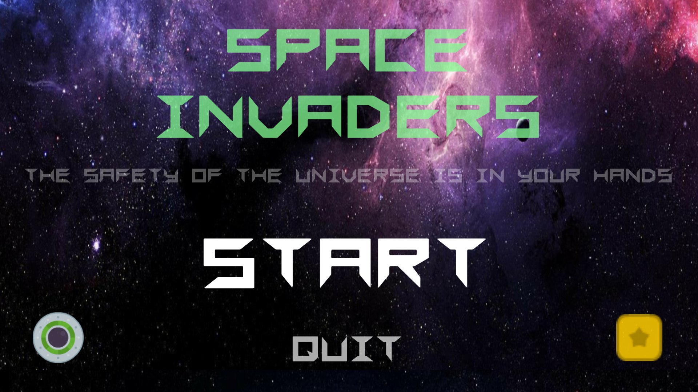

# Space-Invader-Game
## Space Invader Game for Coding Contest from [IT-talents](https://www.it-talents.de/) in partnership with [Airbus](https://www.airbus.com/).
## Screenshots

## To Play the Game 
If you want to play the game on your browser, please visit [Space Invaders](https://orkhan.itch.io/space-invaders)
It is a desktop game and controllers are not adjsted for mobile gaming, so make sure to open on a PC or Laptop.
## Tools used while developing this project
- Unity.
- Visual Studio Code. Coding in C# Programming Language.
- GitBash.
- Inno Setup Compiler (For creating installer files)
## How to install?
### For Windows User
- Open Folder Named "Game" in Space-Invader-Game repository.
- Proceed to InstallerWindows Folder.
- Click on SpaceInvadersSetup.exe and download.
- Most probably you will face a warning message. Just Right click on warning and click "Save".
- Now you have an installer file! Open it.
- Windows Defender will prevent running it. Click "More Info" and Click "Run Anyway".
- Proceed with installing and enjoy the game!
### For Mac User
- Open Folder Named "Game" in Space-Invader-Game repository.
- Proceed to Mac/x86 
- Download zip file
- Right click on downloaded file and Open.
- Enjoy the game!
## Game Description
### Game Keyboards
- WASD and Arrows for movement
- Space for shooting
- ESC (escape) for Pause
### Known bugs
- When chaotically pressing shooting button it might start shooting by itself even after releasing button(happens not always)
## Contacts 
- E-mail address orkhan.elchuev@gmail.com
- https://github.com/OrkhanElchuev/Space-Invader-Game
## Aknowledgements
- [dafont](https://www.dafont.com/de/)
- [kenneyAssets](https://www.kenney.nl/assets?s=space+shooter)
